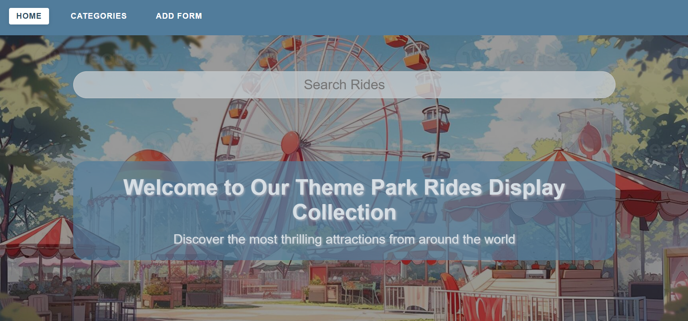
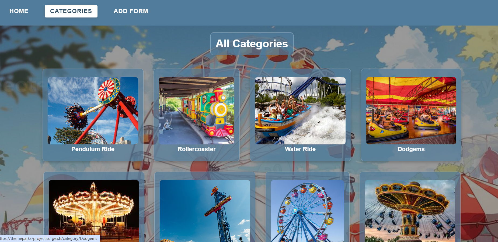
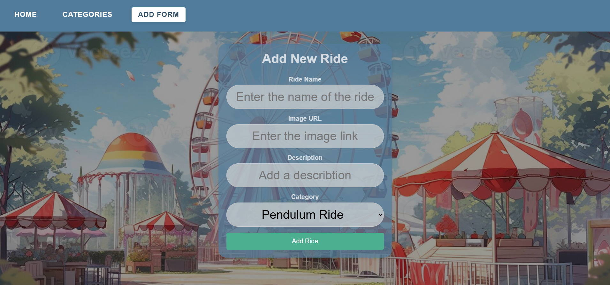
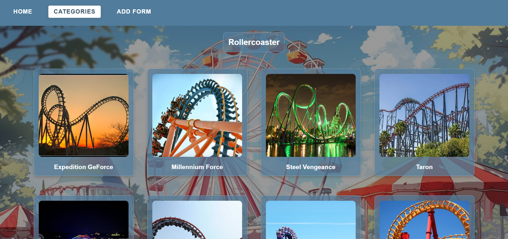

# Theme Park Rides

> This project is for a website about theme parks where users are able to choose a category of rides and browse through the most famous rides around the world. The user is allowed to add and delete their own rides.

## 📑 Table of Contents

- [Overview](#-overview)
- [Technologies Used](#-technologies-used)
- [Planning & Design](#-planning--design)

  - [Wireframes](#-wireframes)

- [Screenshots](#-screenshots)
- [Future Updates](#-future-updates)

## Overview

The website allows users to:

- Add and manage rides.
- Choose a category to view rides.
- Select a specific ride to view it's detials

## Technologies Used

- **Frontend:** HTML, CSS, JavaScript
- **Backend:** Node.js, Express.js, MongoDB, React.js

## Planning & Design

### Wireframes

## Screenshots

## Future Updates
- add a sign in page so users can have seperate lists
